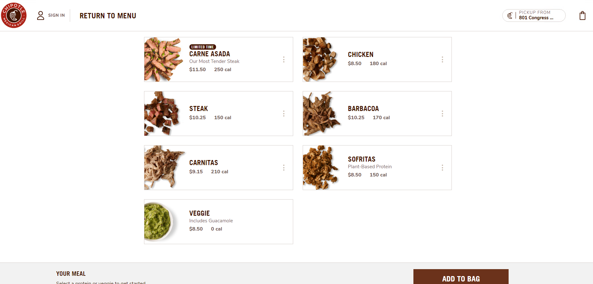

# 🌯 Chipotle - Restaurant Web Scraping Project 🌮

This deliciously coded Python-based project uses the Selenium webdriver to scrape out interesting nuggets of information about your favorite restaurant, Chipotle: where flavor meets tech. 🥑⚙️

## Technological Spices 🔍🍲

**Web Scraping:** Like a determined chef handpicking ingredients from a marketplace, our project extracts data from websites and stores it in your local system for efficient analyis 🗄️🌐

**Python:** Python, the Swiss-army knife of programming languages, serves as our all-rounder of choice, allowing this project to slice and dice data with precision 👨‍🍳🐍

**Selenium:** Meet our reliable sous-chef, Selenium. It automates web browsers, overshadows the monotony, and helps us cook up a batch of fresh data even under pressure 🔧🍳

**Anti-bot systems & CAPTCHA:** These are like the kitchen fires we must stave off! But worry not, we smash through CAPTCHAs and dance around anti-bot systems ensuring smooth scraping operations 🔥🚒

## Get Cookin'! 🥘

Embark on this scrumptious journey with Chipotle. With our scraper, you will be able to explore menus, sieve through reviews, find ratings, and so much more.

**More instructions here...**

## Contribute 🤝

Got a suggestion for a new dish, or found a potential food critic? Contributions, issues, and feature requests are welcome! Feel free to check out the [issues page](<Your Issues Page Link>).

## Buckle up, get scraping, and Bon Appétit! 🧑‍💻🍽️

---

## ©️2022 Your Name & The Web Scraping Team 🎊👨‍🍳

---
